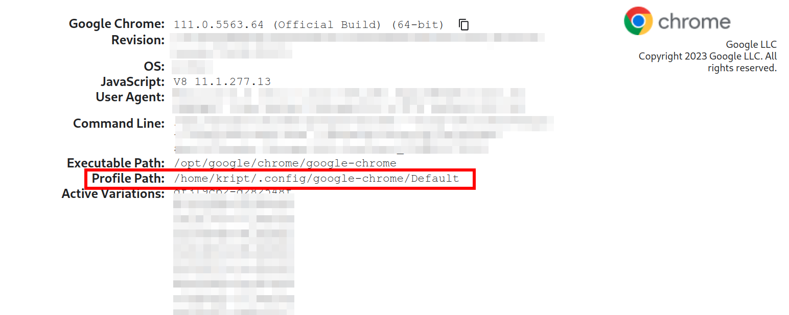

<h1>google-meet-visitor 6.0.8</h1>

<h1 align="center">UNDER DEVELOPMENT</h1>

# Documentation Content
1. [What it does?][1]
2. [Requirements][2]
3. [Usage][3]
    1) [Installation][3.1]
    2) [Configuration][3.2]
        1) [Explanation of variables][3.2.1]
    3) [Run][3.3]
    4) [Record calls][3.4]
4. [FAQ][4]
    1) [How to get path for USER_DATA_DIR?][4.1]
    2) [Why does webdriver of visitor use minimized option instead of headless?][4.2]
5. [Contribution][5]
6. [License][6]
7. [TODO][7]

# What it does
The main purpose of the google-meet-visitor is just to visit calls in google meet. The main feature is that you can record calls. It will automate all the user actions, i.e join a call, mute the browser micro and cam, submit that you are in the call, etc.

# Requirements
Google Chrome **>=** 100\
Node **>=** 18\
Selenium **>=** 4.1.13

# Usage
## Installation
    git clone git@github.com:KR1470R/google-meet-visitor.git
    npm ci

## Configuration
All the config parameters are stored in the .env file in root of the project. Also, you can specify it by yourself without .env, just define these variables in your global environment. Variables with asterisk* are important, you won't be able to run the program without them.

### Explanation of variables:
***USER_DATA_DIR**** - specify the path to your google chrome profile directory. [See here][4.1].\
***TARGET_CALL_LINK**** - link to your google meet call.\
***CALL_TIMER_MINUTES**** - how many minutes the visitor must stay at call\
***MINIMIZED*** - true or false. If true, the window of the browser will be minimized and if false - maximazed. By default false.\
***MUTE*** - true or false. If true, the browser will be totally muted. By default false.\
***RECORD_TAB*** - true or false. If true, the visitor will record the call. By default false. [See here][3.4].\
***OUTPUT_RECORD_TAB*** - custom path of output records. By default is `dist/records/` in the root.

## Run
‼️Before running visitor, ensure that you have signed in your account.‼️\
⚠️It might ask you to login again to ensure that it's you, but visitor will recognize and give you 5 minutes to input password.
Just go to the root directory of the google-meet-visitor and type the command:

    npm run make # build the program, run after every changes you made in the project.
    npm run start # run the visitor, you have not build the project every time if you have already build it.

# FAQ
## How to get path for ***USER_DATA_DIR***?

The main purpose of using user data directory is to automate authorization of user in google meet. Don't worry, it doesn't steal your data.
1. Open your google chrome.
2. Open this link `chrome://version/`
3. Copy the path in a **Profile Path** row and paste to your ***USER_DATA_DIR*** variable.

## Why does webdriver of visitor use minimized option instead of headless?
Well, on the initial stages of the development that was thought that visitor should run with headless option, at least for non-recording mode. But, i faced with a lot of problem by doing it, i couldn't even join to call with headless mode, i have tried a lot of options, nevertheless google meet just have blocked it. So the only solution i came up with is just use minimized mode.

# Contribution
### I would be very glad for your contributions. Any questions, issues and suggestions will welcome!
### Feel free to create new issues🙃
# License

# TODO
- correct output videos format
- make alternative configuration of google-meet-visitor - by using flags in the command line.
- test all cases

[1]:https://github.com/KR1470R/google-meet-visitor#what-it-does
[2]:https://github.com/KR1470R/google-meet-visitor#requirements
[3]:https://github.com/KR1470R/google-meet-visitor#usage
[3.1]:https://github.com/KR1470R/google-meet-visitor#installation
[3.2]:https://github.com/KR1470R/google-meet-visitor#configuration
[3.2.1]:https://github.com/KR1470R/google-meet-visitor#explanation-of-variables
[3.3]:https://github.com/KR1470R/google-meet-visitor#run
[3.4]:https://github.com/KR1470R/google-meet-visitor#record-calls
[4]:https://github.com/KR1470R/google-meet-visitor#faq
[4.1]:https://github.com/KR1470R/google-meet-visitor#how-to-get-path-for-user_data_dir
[4.2]:https://github.com/KR1470R/google-meet-visitor#why-does-webdriver-of-visitor-use-minimized-option-instead-of-headless
[5]:https://github.com/KR1470R/google-meet-visitor#contribution
[6]:https://github.com/KR1470R/google-meet-visitor#license
[7]:https://github.com/KR1470R/google-meet-visitor#todo
